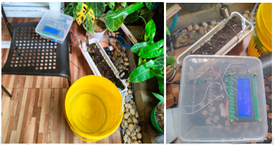
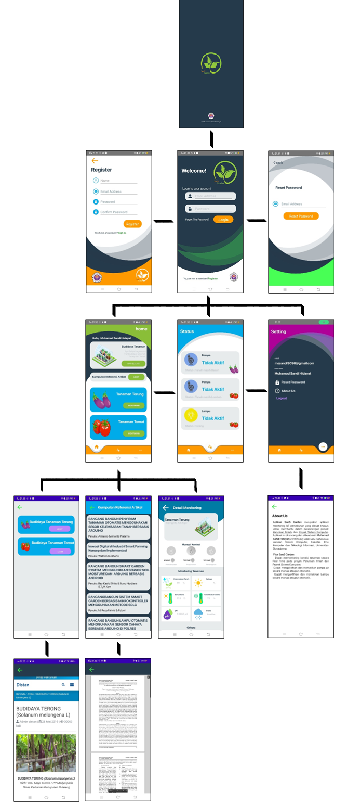

# aplikasi-smart-monitoring-SanS-Garden
Project ini merupakan project penelitian ilmiah dari sistem purwarupa monitoring dan penyiraman secara otomatis maupun manual pada sebuah tanaman. Pada tanaman sendiri perlu diperhatikan beberapa faktor penting, seperti pH tanah yang ideal dan suhu optimal. Selain itu, faktor penyiraman juga memainkan peran krusial dalam budidaya tanaman. Maka dari faktor tersebut diperlukan sebuah sistem yang dapat membantu petani dalam memantau kondisi pertumbuhan tanaman secara efisien dan melakukan penyiraman yang sesuai dengan kebutuhan tanaman. Sistem yang dirancang ini menggunakan mikrokontroler ESP-32 dan dan beberapa sensor, termasuk sensor kelembaban tanah untuk mengetahui kadar air yang ada di dalam tanah, sensor pH untuk mengetahui kadar pH di dalam tanah, serta sensor suhu dan kelembaban untuk mengetahui temperatur dan kelembaban udara di sekitar tanaman. Berikutnya untuk hasil data yang diperoleh dari setiap sensor akan ditampilkan pada layar LCD dan akan dilanjutkan untuk mengaktifkan output terkait. Selain itu, data tersebut akan dikirimkan ke Firebase sebagai real-time database dan akan diteruskan dan ditampilkan pada aplikasi Android. Aplikasi tersebut tidak hanya menampilkan data dari sensor, tetapi juga memungkinkan pengguna untuk melakukan kontrol manual terhadap penyiraman tanaman jika diperlukan. Dalam mode otomatis, sistem penyiraman akan aktif setiap pukul 07.00 pagi dan akan berfungsi kembali jika sensor mendeteksi keadaan tanah yang kering. 

## Fitur Aplikasi
1. Dapat memantau (monitoring) hasil Kelembaban Tanah, cahaya, suhu dan kelembaban udara, kadar pH tanah, cuaca, serta water level.
2. Dapat mengontrol secara manual penyiraman dari tanaman serta lampu.
3. Terdapat kumpulan referensi jurnal yang digunakan dalam penelitian
4. terdapat fitur login untuk membatasi pengguna

## Fitur Sistem Alat 
1. Dapat melakukan penyiraman secara otomatis berdasarkan kelembaban tanah dan kondisi lingkungan.
2. Dapat melakukan penyiraman secara otomatis setiap jam 07:00
3. Dapat dikontrol secara manual dari aplikasi.
4. Dapat menampilkan hasil yang didapat dari sensor ke LCD

## Komponen Penunjang Pembuatan aplikasi dan sistem alat
1. Android Studio (java)
2. Arduino IDE
3. Firebase Realtime database & authentication
4. Mikrokontroler ESP32
5. Sensor Kelembaban Tanah, cahaya, suhu dan kelembaban udara, kadar pH tanah, cuaca, serta water level.
6. Komponen output alat seperti relay, LCD I2C (20x4), Relay, Pompa DC 12V, lampu grow light uv


## Schematic Prototype System
<p align="center">
  
</p>

## Desain Prototype alat
<p align="center">
  
</p>

## Desain Aplikasi
<p align="center">
  
</p>

## Structure Folder
```md
aplikasi-smart-monitoring-SanS-Garden
 ┣ .git
 ┃ ┣ hooks
 ┃ ┃ ┣ applypatch-msg.sample
 ┃ ┃ ┣ commit-msg.sample
 ┃ ┃ ┣ fsmonitor-watchman.sample
 ┃ ┃ ┣ post-update.sample
 ┃ ┃ ┣ pre-applypatch.sample
 ┃ ┃ ┣ pre-commit.sample
 ┃ ┃ ┣ pre-merge-commit.sample
 ┃ ┃ ┣ pre-push.sample
 ┃ ┃ ┣ pre-rebase.sample
 ┃ ┃ ┣ pre-receive.sample
 ┃ ┃ ┣ prepare-commit-msg.sample
 ┃ ┃ ┣ push-to-checkout.sample
 ┃ ┃ ┗ update.sample
 ┃ ┣ info
 ┃ ┃ ┗ exclude
 ┃ ┣ logs
 ┃ ┃ ┣ refs
 ┃ ┃ ┃ ┣ heads
 ┃ ┃ ┃ ┃ ┗ master
 ┃ ┃ ┃ ┗ remotes
 ┃ ┃ ┃ ┃ ┗ origin
 ┃ ┃ ┃ ┃ ┃ ┗ HEAD
 ┃ ┃ ┗ HEAD
 ┃ ┣ objects
 ┃ ┃ ┣ info
 ┃ ┃ ┗ pack
 ┃ ┃ ┃ ┣ pack-e5acdeb15be06cbab4317bbaacfada74f5f50c9f.idx
 ┃ ┃ ┃ ┗ pack-e5acdeb15be06cbab4317bbaacfada74f5f50c9f.pack
 ┃ ┣ refs
 ┃ ┃ ┣ heads
 ┃ ┃ ┃ ┗ master
 ┃ ┃ ┣ remotes
 ┃ ┃ ┃ ┗ origin
 ┃ ┃ ┃ ┃ ┗ HEAD
 ┃ ┃ ┗ tags
 ┃ ┣ config
 ┃ ┣ description
 ┃ ┣ HEAD
 ┃ ┣ index
 ┃ ┗ packed-refs
 ┣ .gradle
 ┃ ┣ 7.5
 ┃ ┃ ┣ checksums
 ┃ ┃ ┃ ┣ checksums.lock
 ┃ ┃ ┃ ┗ sha1-checksums.bin
 ┃ ┃ ┣ dependencies-accessors
 ┃ ┃ ┃ ┣ dependencies-accessors.lock
 ┃ ┃ ┃ ┗ gc.properties
 ┃ ┃ ┣ executionHistory
 ┃ ┃ ┃ ┗ executionHistory.lock
 ┃ ┃ ┣ fileChanges
 ┃ ┃ ┃ ┗ last-build.bin
 ┃ ┃ ┣ fileHashes
 ┃ ┃ ┃ ┣ fileHashes.bin
 ┃ ┃ ┃ ┗ fileHashes.lock
 ┃ ┃ ┣ vcsMetadata
 ┃ ┃ ┗ gc.properties
 ┃ ┣ buildOutputCleanup
 ┃ ┃ ┣ buildOutputCleanup.lock
 ┃ ┃ ┣ cache.properties
 ┃ ┃ ┗ outputFiles.bin
 ┃ ┗ vcs-1
 ┃ ┃ ┗ gc.properties
 ┣ .idea
 ┃ ┣ libraries
 ┃ ┃ ┣ Gradle__androidx_activity_activity_1_2_4_aar.xml
 ┃ ┃ ┣ Gradle__androidx_activity_activity_ktx_1_2_3_aar.xml
 ┃ ┃ ┣ Gradle__androidx_annotation_annotation_1_4_0_alpha02.xml
 ┃ ┃ ┣ Gradle__androidx_annotation_annotation_experimental_1_1_0_aar.xml
 ┃ ┃ ┣ Gradle__androidx_appcompat_appcompat_1_4_1_aar.xml
 ┃ ┃ ┣ Gradle__androidx_appcompat_appcompat_resources_1_4_1_aar.xml
 ┃ ┃ ┣ Gradle__androidx_arch_core_core_common_2_1_0.xml
 ┃ ┃ ┣ Gradle__androidx_arch_core_core_runtime_2_1_0_aar.xml
 ┃ ┃ ┣ Gradle__androidx_asynclayoutinflater_asynclayoutinflater_1_0_0_aar.xml
 ┃ ┃ ┣ Gradle__androidx_browser_browser_1_0_0_aar.xml
 ┃ ┃ ┣ Gradle__androidx_cardview_cardview_1_0_0_aar.xml
 ┃ ┃ ┣ Gradle__androidx_collection_collection_1_1_0.xml
 ┃ ┃ ┣ Gradle__androidx_collection_collection_ktx_1_1_0.xml
 ┃ ┃ ┣ Gradle__androidx_constraintlayout_constraintlayout_2_1_3_aar.xml
 ┃ ┃ ┣ Gradle__androidx_coordinatorlayout_coordinatorlayout_1_1_0_aar.xml
 ┃ ┃ ┣ Gradle__androidx_core_core_1_7_0_aar.xml
 ┃ ┃ ┣ Gradle__androidx_core_core_ktx_1_2_0_aar.xml
 ┃ ┃ ┣ Gradle__androidx_core_core_ktx_1_5_0_aar.xml
 ┃ ┃ ┣ Gradle__androidx_cursoradapter_cursoradapter_1_0_0_aar.xml
 ┃ ┃ ┣ Gradle__androidx_customview_customview_1_1_0_aar.xml
 ┃ ┃ ┣ Gradle__androidx_databinding_viewbinding_7_4_1_aar.xml
 ┃ ┃ ┣ Gradle__androidx_documentfile_documentfile_1_0_0_aar.xml
 ┃ ┃ ┣ Gradle__androidx_drawerlayout_drawerlayout_1_1_1_aar.xml
 ┃ ┃ ┣ Gradle__androidx_dynamicanimation_dynamicanimation_1_0_0_aar.xml
 ┃ ┃ ┣ Gradle__androidx_fragment_fragment_1_4_1_aar.xml
 ┃ ┃ ┣ Gradle__androidx_fragment_fragment_ktx_1_4_1_aar.xml
 ┃ ┃ ┣ Gradle__androidx_interpolator_interpolator_1_0_0_aar.xml
 ┃ ┃ ┣ Gradle__androidx_legacy_legacy_support_core_ui_1_0_0_aar.xml
 ┃ ┃ ┣ Gradle__androidx_legacy_legacy_support_core_utils_1_0_0_aar.xml
 ┃ ┃ ┣ Gradle__androidx_legacy_legacy_support_v4_1_0_0_aar.xml
 ┃ ┃ ┣ Gradle__androidx_lifecycle_lifecycle_common_2_4_1.xml
 ┃ ┃ ┣ Gradle__androidx_lifecycle_lifecycle_livedata_2_4_1_aar.xml
 ┃ ┃ ┣ Gradle__androidx_lifecycle_lifecycle_livedata_core_2_4_1_aar.xml
 ┃ ┃ ┣ Gradle__androidx_lifecycle_lifecycle_livedata_core_ktx_2_4_1_aar.xml
 ┃ ┃ ┣ Gradle__androidx_lifecycle_lifecycle_livedata_ktx_2_4_1_aar.xml
 ┃ ┃ ┣ Gradle__androidx_lifecycle_lifecycle_runtime_2_3_1_aar.xml
 ┃ ┃ ┣ Gradle__androidx_lifecycle_lifecycle_runtime_2_4_0_aar.xml
 ┃ ┃ ┣ Gradle__androidx_lifecycle_lifecycle_runtime_ktx_2_3_1_aar.xml
 ┃ ┃ ┣ Gradle__androidx_lifecycle_lifecycle_viewmodel_2_4_1_aar.xml
 ┃ ┃ ┣ Gradle__androidx_lifecycle_lifecycle_viewmodel_ktx_2_4_1_aar.xml
 ┃ ┃ ┣ Gradle__androidx_lifecycle_lifecycle_viewmodel_savedstate_2_3_1_aar.xml
 ┃ ┃ ┣ Gradle__androidx_loader_loader_1_0_0_aar.xml
 ┃ ┃ ┣ Gradle__androidx_localbroadcastmanager_localbroadcastmanager_1_0_0_aar.xml
 ┃ ┃ ┣ Gradle__androidx_media_media_1_0_0_aar.xml
 ┃ ┃ ┣ Gradle__androidx_navigation_navigation_common_2_4_1_aar.xml
 ┃ ┃ ┣ Gradle__androidx_navigation_navigation_fragment_2_4_1_aar.xml
 ┃ ┃ ┣ Gradle__androidx_navigation_navigation_runtime_2_4_1_aar.xml
 ┃ ┃ ┣ Gradle__androidx_navigation_navigation_ui_2_4_1_aar.xml
 ┃ ┃ ┣ Gradle__androidx_print_print_1_0_0_aar.xml
 ┃ ┃ ┣ Gradle__androidx_recyclerview_recyclerview_1_3_0_alpha02_aar.xml
 ┃ ┃ ┣ Gradle__androidx_savedstate_savedstate_1_1_0_aar.xml
 ┃ ┃ ┣ Gradle__androidx_savedstate_savedstate_ktx_1_1_0_aar.xml
 ┃ ┃ ┣ Gradle__androidx_slidingpanelayout_slidingpanelayout_1_2_0_aar.xml
 ┃ ┃ ┣ Gradle__androidx_swiperefreshlayout_swiperefreshlayout_1_0_0_aar.xml
 ┃ ┃ ┣ Gradle__androidx_test_core_1_4_0_aar.xml
 ┃ ┃ ┣ Gradle__androidx_test_espresso_espresso_core_3_4_0_aar.xml
 ┃ ┃ ┣ Gradle__androidx_test_espresso_espresso_idling_resource_3_4_0_aar.xml
 ┃ ┃ ┣ Gradle__androidx_test_ext_junit_1_1_3_aar.xml
 ┃ ┃ ┣ Gradle__androidx_test_monitor_1_4_0_aar.xml
 ┃ ┃ ┣ Gradle__androidx_test_runner_1_4_0_aar.xml
 ┃ ┃ ┣ Gradle__androidx_test_services_storage_1_4_0_aar.xml
 ┃ ┃ ┣ Gradle__androidx_transition_transition_1_2_0_aar.xml
 ┃ ┃ ┣ Gradle__androidx_transition_transition_1_4_1_aar.xml
 ┃ ┃ ┣ Gradle__androidx_vectordrawable_vectordrawable_1_1_0_aar.xml
 ┃ ┃ ┣ Gradle__androidx_vectordrawable_vectordrawable_animated_1_1_0_aar.xml
 ┃ ┃ ┣ Gradle__androidx_versionedparcelable_versionedparcelable_1_1_1_aar.xml
 ┃ ┃ ┣ Gradle__androidx_viewpager2_viewpager2_1_0_0_aar.xml
 ┃ ┃ ┣ Gradle__androidx_viewpager_viewpager_1_0_0_aar.xml
 ┃ ┃ ┣ Gradle__com_etebarian_meow_bottom_navigation_java_1_2_0_aar.xml
 ┃ ┃ ┣ Gradle__com_fasterxml_jackson_core_jackson_annotations_2_2_2.xml
 ┃ ┃ ┣ Gradle__com_fasterxml_jackson_core_jackson_core_2_2_2.xml
 ┃ ┃ ┣ Gradle__com_fasterxml_jackson_core_jackson_databind_2_2_2.xml
 ┃ ┃ ┣ Gradle__com_firebase_firebase_client_android_2_3_1.xml
 ┃ ┃ ┣ Gradle__com_firebase_firebase_client_jvm_2_3_1.xml
 ┃ ┃ ┣ Gradle__com_firebase_tubesock_0_0_11.xml
 ┃ ┃ ┣ Gradle__com_google_android_gms_play_services_auth_api_phone_17_4_0_aar.xml
 ┃ ┃ ┣ Gradle__com_google_android_gms_play_services_basement_18_0_0_aar.xml
 ┃ ┃ ┣ Gradle__com_google_android_gms_play_services_base_18_0_1_aar.xml
 ┃ ┃ ┣ Gradle__com_google_android_gms_play_services_safetynet_17_0_0_aar.xml
 ┃ ┃ ┣ Gradle__com_google_android_gms_play_services_tasks_18_0_1_aar.xml
 ┃ ┃ ┣ Gradle__com_google_android_material_material_1_5_0_aar.xml
 ┃ ┃ ┣ Gradle__com_google_code_findbugs_jsr305_3_0_2.xml
 ┃ ┃ ┣ Gradle__com_google_errorprone_error_prone_annotations_2_5_1.xml
 ┃ ┃ ┣ Gradle__com_google_errorprone_error_prone_annotations_2_9_0.xml
 ┃ ┃ ┣ Gradle__com_google_firebase_firebase_annotations_16_1_0.xml
 ┃ ┃ ┣ Gradle__com_google_firebase_firebase_appcheck_16_0_0_aar.xml
 ┃ ┃ ┣ Gradle__com_google_firebase_firebase_appcheck_debug_16_0_0_aar.xml
 ┃ ┃ ┣ Gradle__com_google_firebase_firebase_appcheck_interop_16_0_0_aar.xml
 ┃ ┃ ┣ Gradle__com_google_firebase_firebase_auth_21_0_3_aar.xml
 ┃ ┃ ┣ Gradle__com_google_firebase_firebase_auth_interop_20_0_0_aar.xml
 ┃ ┃ ┣ Gradle__com_google_firebase_firebase_common_20_1_1_aar.xml
 ┃ ┃ ┣ Gradle__com_google_firebase_firebase_components_17_0_0_aar.xml
 ┃ ┃ ┣ Gradle__com_google_firebase_firebase_database_20_0_4_aar.xml
 ┃ ┃ ┣ Gradle__com_google_firebase_firebase_database_collection_18_0_1_aar.xml
 ┃ ┃ ┣ Gradle__com_google_firebase_firebase_firestore_24_1_0_aar.xml
 ┃ ┃ ┣ Gradle__com_google_firebase_protolite_well_known_types_18_0_0_aar.xml
 ┃ ┃ ┣ Gradle__com_google_guava_failureaccess_1_0_1.xml
 ┃ ┃ ┣ Gradle__com_google_guava_guava_30_1_1_android.xml
 ┃ ┃ ┣ Gradle__com_google_guava_listenablefuture_9999_0_empty_to_avoid_conflict_with_guava.xml
 ┃ ┃ ┣ Gradle__com_google_j2objc_j2objc_annotations_1_3.xml
 ┃ ┃ ┣ Gradle__com_google_protobuf_protobuf_javalite_3_19_2.xml
 ┃ ┃ ┣ Gradle__com_squareup_javawriter_2_1_1.xml
 ┃ ┃ ┣ Gradle__com_squareup_okhttp_okhttp_2_7_5.xml
 ┃ ┃ ┣ Gradle__com_squareup_okio_okio_1_17_5.xml
 ┃ ┃ ┣ Gradle__com_squareup_okio_okio_1_6_0.xml
 ┃ ┃ ┣ Gradle__io_grpc_grpc_android_1_44_1_aar.xml
 ┃ ┃ ┣ Gradle__io_grpc_grpc_api_1_44_1.xml
 ┃ ┃ ┣ Gradle__io_grpc_grpc_context_1_44_1.xml
 ┃ ┃ ┣ Gradle__io_grpc_grpc_core_1_44_1.xml
 ┃ ┃ ┣ Gradle__io_grpc_grpc_okhttp_1_44_1.xml
 ┃ ┃ ┣ Gradle__io_grpc_grpc_protobuf_lite_1_44_1.xml
 ┃ ┃ ┣ Gradle__io_grpc_grpc_stub_1_44_1.xml
 ┃ ┃ ┣ Gradle__javax_inject_javax_inject_1.xml
 ┃ ┃ ┣ Gradle__junit_junit_4_12.xml
 ┃ ┃ ┣ Gradle__junit_junit_4_13_2.xml
 ┃ ┃ ┣ Gradle__org_checkerframework_checker_compat_qual_2_5_5.xml
 ┃ ┃ ┣ Gradle__org_hamcrest_hamcrest_core_1_3.xml
 ┃ ┃ ┣ Gradle__org_hamcrest_hamcrest_integration_1_3.xml
 ┃ ┃ ┣ Gradle__org_hamcrest_hamcrest_library_1_3.xml
 ┃ ┃ ┣ Gradle__org_jetbrains_annotations_13_0.xml
 ┃ ┃ ┣ Gradle__org_jetbrains_kotlinx_kotlinx_coroutines_android_1_5_0.xml
 ┃ ┃ ┣ Gradle__org_jetbrains_kotlinx_kotlinx_coroutines_android_1_5_2.xml
 ┃ ┃ ┣ Gradle__org_jetbrains_kotlinx_kotlinx_coroutines_core_jvm_1_5_0.xml
 ┃ ┃ ┣ Gradle__org_jetbrains_kotlinx_kotlinx_coroutines_core_jvm_1_5_2.xml
 ┃ ┃ ┣ Gradle__org_jetbrains_kotlin_kotlin_stdlib_1_6_10.xml
 ┃ ┃ ┣ Gradle__org_jetbrains_kotlin_kotlin_stdlib_common_1_6_10.xml
 ┃ ┃ ┣ Gradle__org_jetbrains_kotlin_kotlin_stdlib_jdk7_1_5_0.xml
 ┃ ┃ ┣ Gradle__org_jetbrains_kotlin_kotlin_stdlib_jdk7_1_5_30.xml
 ┃ ┃ ┣ Gradle__org_jetbrains_kotlin_kotlin_stdlib_jdk8_1_5_0.xml
 ┃ ┃ ┗ Gradle__org_jetbrains_kotlin_kotlin_stdlib_jdk8_1_5_30.xml
 ┃ ┣ modules
 ┃ ┃ ┣ app
 ┃ ┃ ┃ ┣ SanS_Garden.app.androidTest.iml
 ┃ ┃ ┃ ┣ SanS_Garden.app.iml
 ┃ ┃ ┃ ┣ SanS_Garden.app.main.iml
 ┃ ┃ ┃ ┗ SanS_Garden.app.unitTest.iml
 ┃ ┃ ┗ SanS_Garden.iml
 ┃ ┣ .gitignore
 ┃ ┣ .name
 ┃ ┣ compiler.xml
 ┃ ┣ deploymentTargetDropDown.xml
 ┃ ┣ gradle.xml
 ┃ ┣ misc.xml
 ┃ ┣ modules.xml
 ┃ ┣ render.experimental.xml
 ┃ ┣ vcs.xml
 ┃ ┗ workspace.xml
 ┣ app
 ┃ ┣ release
 ┃ ┃ ┗ app-release.aab
 ┃ ┣ src
 ┃ ┃ ┣ androidTest
 ┃ ┃ ┃ ┗ java
 ┃ ┃ ┃ ┃ ┗ com
 ┃ ┃ ┃ ┃ ┃ ┗ example
 ┃ ┃ ┃ ┃ ┃ ┃ ┗ sansgarden
 ┃ ┃ ┃ ┃ ┃ ┃ ┃ ┗ ExampleInstrumentedTest.java
 ┃ ┃ ┣ main
 ┃ ┃ ┃ ┣ java
 ┃ ┃ ┃ ┃ ┗ com
 ┃ ┃ ┃ ┃ ┃ ┗ example
 ┃ ┃ ┃ ┃ ┃ ┃ ┗ sansgarden
 ┃ ┃ ┃ ┃ ┃ ┃ ┃ ┣ AboutUs.java
 ┃ ┃ ┃ ┃ ┃ ┃ ┃ ┣ AdapterRefArtikel.java
 ┃ ┃ ┃ ┃ ┃ ┃ ┃ ┣ ArtikelModel.java
 ┃ ┃ ┃ ┃ ┃ ┃ ┃ ┣ ArtikelView.java
 ┃ ┃ ┃ ┃ ┃ ┃ ┃ ┣ bna.java
 ┃ ┃ ┃ ┃ ┃ ┃ ┃ ┣ FireApp.java
 ┃ ┃ ┃ ┃ ┃ ┃ ┃ ┣ Home.java
 ┃ ┃ ┃ ┃ ┃ ┃ ┃ ┣ MainActivity.java
 ┃ ┃ ┃ ┃ ┃ ┃ ┃ ┣ Maribelajar.java
 ┃ ┃ ┃ ┃ ┃ ┃ ┃ ┣ MonitoringTerung.java
 ┃ ┃ ┃ ┃ ┃ ┃ ┃ ┣ MonitoringTomat.java
 ┃ ┃ ┃ ┃ ┃ ┃ ┃ ┣ Notification.java
 ┃ ┃ ┃ ┃ ┃ ┃ ┃ ┣ RecyclerClickOnListener.java
 ┃ ┃ ┃ ┃ ┃ ┃ ┃ ┣ ReferensiArtikel.java
 ┃ ┃ ┃ ┃ ┃ ┃ ┃ ┣ Register.java
 ┃ ┃ ┃ ┃ ┃ ┃ ┃ ┣ ResetPassword.java
 ┃ ┃ ┃ ┃ ┃ ┃ ┃ ┣ setting.java
 ┃ ┃ ┃ ┃ ┃ ┃ ┃ ┣ Splashscreen.java
 ┃ ┃ ┃ ┃ ┃ ┃ ┃ ┗ WEBView.java
 ┃ ┃ ┃ ┣ res
 ┃ ┃ ┃ ┃ ┣ drawable
 ┃ ┃ ┃ ┃ ┃ ┣ buttonautocahaya.png
 ┃ ┃ ┃ ┃ ┃ ┣ buttonautoudara.png
 ┃ ┃ ┃ ┃ ┃ ┣ buttoncahaya.png
 ┃ ┃ ┃ ┃ ┃ ┣ buttoncahayapress.png
 ┃ ┃ ┃ ┃ ┃ ┣ buttonudara.png
 ┃ ┃ ┃ ┃ ┃ ┣ buttonudarapress.png
 ┃ ┃ ┃ ┃ ┃ ┣ custom_button_water.xml
 ┃ ┃ ┃ ┃ ┃ ┣ ic_baseline_arrow_back_24.xml
 ┃ ┃ ┃ ┃ ┃ ┣ ic_baseline_arrow_back_white_24.xml
 ┃ ┃ ┃ ┃ ┃ ┣ ic_baseline_electrical_services_24.xml
 ┃ ┃ ┃ ┃ ┃ ┣ ic_baseline_error_outline_24.xml
 ┃ ┃ ┃ ┃ ┃ ┣ ic_baseline_home_24.xml
 ┃ ┃ ┃ ┃ ┃ ┣ ic_baseline_lock_24.xml
 ┃ ┃ ┃ ┃ ┃ ┣ ic_baseline_more_horiz_24.xml
 ┃ ┃ ┃ ┃ ┃ ┣ ic_baseline_notifications_24.xml
 ┃ ┃ ┃ ┃ ┃ ┣ ic_dashboard_black_24dp.xml
 ┃ ┃ ┃ ┃ ┃ ┣ ic_home_black_24dp.xml
 ┃ ┃ ┃ ┃ ┃ ┣ ic_icon_humidity.xml
 ┃ ┃ ┃ ┃ ┃ ┣ ic_icon_sunlight.xml
 ┃ ┃ ┃ ┃ ┃ ┣ ic_icon_temperature.xml
 ┃ ┃ ┃ ┃ ┃ ┣ ic_launcher_background.xml
 ┃ ┃ ┃ ┃ ┃ ┣ ic_notifications_black_24dp.xml
 ┃ ┃ ┃ ┃ ┃ ┣ kotak.xml
 ┃ ┃ ┃ ┃ ┃ ┣ kotakmassage.xml
 ┃ ┃ ┃ ┃ ┃ ┣ logoair.png
 ┃ ┃ ┃ ┃ ┃ ┣ logoairauto.png
 ┃ ┃ ┃ ┃ ┃ ┗ logoairoff.png
 ┃ ┃ ┃ ┃ ┣ drawable-hdpi
 ┃ ┃ ┃ ┃ ┃ ┣ accountsc.png
 ┃ ┃ ┃ ┃ ┃ ┣ atashome.png
 ┃ ┃ ┃ ┃ ┃ ┣ backgroundemail.png
 ┃ ┃ ┃ ┃ ┃ ┣ backgroundloginpolos.png
 ┃ ┃ ┃ ┃ ┃ ┣ backgroundpassword.png
 ┃ ┃ ┃ ┃ ┃ ┣ backgroundregister.png
 ┃ ┃ ┃ ┃ ┃ ┣ backgroundreset.png
 ┃ ┃ ┃ ┃ ┃ ┣ backreset.png
 ┃ ┃ ┃ ┃ ┃ ┣ control.png
 ┃ ┃ ┃ ┃ ┃ ┣ greenhouse.png
 ┃ ┃ ┃ ┃ ┃ ┣ greenhousemonitoring.png
 ┃ ┃ ┃ ┃ ┃ ┣ home.png
 ┃ ┃ ┃ ┃ ┃ ┣ icon_ph.png
 ┃ ┃ ┃ ┃ ┃ ┣ icon_soil.png
 ┃ ┃ ┃ ┃ ┃ ┣ lampulogo.png
 ┃ ┃ ┃ ┃ ┃ ┣ logoemail.png
 ┃ ┃ ┃ ┃ ┃ ┣ logogundar.png
 ┃ ┃ ┃ ┃ ┃ ┣ logopassword.png
 ┃ ┃ ┃ ┃ ┃ ┣ logosansgardenapk.png
 ┃ ┃ ┃ ┃ ┃ ┣ logosansgardenpi3.png
 ┃ ┃ ┃ ┃ ┃ ┣ logosansgardenpi4.png
 ┃ ┃ ┃ ┃ ┃ ┣ logousername.png
 ┃ ┃ ┃ ┃ ┃ ┣ mainscreen.png
 ┃ ┃ ┃ ┃ ┃ ┣ monitoring.png
 ┃ ┃ ┃ ┃ ┃ ┣ panahback.png
 ┃ ┃ ┃ ┃ ┃ ┣ pompa.png
 ┃ ┃ ┃ ┃ ┃ ┣ rainlogo.png
 ┃ ┃ ┃ ┃ ┃ ┣ terung.png
 ┃ ┃ ┃ ┃ ┃ ┣ tomat.png
 ┃ ┃ ┃ ┃ ┃ ┣ tombollogin.png
 ┃ ┃ ┃ ┃ ┃ ┣ tombolregister.png
 ┃ ┃ ┃ ┃ ┃ ┣ tombolreset.png
 ┃ ┃ ┃ ┃ ┃ ┗ watertanklogo.png
 ┃ ┃ ┃ ┃ ┣ drawable-ldpi
 ┃ ┃ ┃ ┃ ┃ ┣ accountsc.png
 ┃ ┃ ┃ ┃ ┃ ┣ atashome.png
 ┃ ┃ ┃ ┃ ┃ ┣ backgroundemail.png
 ┃ ┃ ┃ ┃ ┃ ┣ backgroundloginpolos.png
 ┃ ┃ ┃ ┃ ┃ ┣ backgroundpassword.png
 ┃ ┃ ┃ ┃ ┃ ┣ backgroundregister.png
 ┃ ┃ ┃ ┃ ┃ ┣ backgroundreset.png
 ┃ ┃ ┃ ┃ ┃ ┣ backreset.png
 ┃ ┃ ┃ ┃ ┃ ┣ control.png
 ┃ ┃ ┃ ┃ ┃ ┣ greenhouse.png
 ┃ ┃ ┃ ┃ ┃ ┣ greenhousemonitoring.png
 ┃ ┃ ┃ ┃ ┃ ┣ home.png
 ┃ ┃ ┃ ┃ ┃ ┣ icon_ph.png
 ┃ ┃ ┃ ┃ ┃ ┣ icon_soil.png
 ┃ ┃ ┃ ┃ ┃ ┣ logoemail.png
 ┃ ┃ ┃ ┃ ┃ ┣ logogundar.png
 ┃ ┃ ┃ ┃ ┃ ┣ logopassword.png
 ┃ ┃ ┃ ┃ ┃ ┣ logosansgardenapk.png
 ┃ ┃ ┃ ┃ ┃ ┣ logosansgardenpi3.png
 ┃ ┃ ┃ ┃ ┃ ┣ logosansgardenpi4.png
 ┃ ┃ ┃ ┃ ┃ ┣ logousername.png
 ┃ ┃ ┃ ┃ ┃ ┣ mainscreen.png
 ┃ ┃ ┃ ┃ ┃ ┣ monitoring.png
 ┃ ┃ ┃ ┃ ┃ ┣ panahback.png
 ┃ ┃ ┃ ┃ ┃ ┣ rainlogo.png
 ┃ ┃ ┃ ┃ ┃ ┣ terung.png
 ┃ ┃ ┃ ┃ ┃ ┣ tomat.png
 ┃ ┃ ┃ ┃ ┃ ┣ tombollogin.png
 ┃ ┃ ┃ ┃ ┃ ┣ tombolregister.png
 ┃ ┃ ┃ ┃ ┃ ┣ tombolreset.png
 ┃ ┃ ┃ ┃ ┃ ┗ watertanklogo.png
 ┃ ┃ ┃ ┃ ┣ drawable-mdpi
 ┃ ┃ ┃ ┃ ┃ ┣ accountsc.png
 ┃ ┃ ┃ ┃ ┃ ┣ atashome.png
 ┃ ┃ ┃ ┃ ┃ ┣ backgroundemail.png
 ┃ ┃ ┃ ┃ ┃ ┣ backgroundloginpolos.png
 ┃ ┃ ┃ ┃ ┃ ┣ backgroundpassword.png
 ┃ ┃ ┃ ┃ ┃ ┣ backgroundregister.png
 ┃ ┃ ┃ ┃ ┃ ┣ backgroundreset.png
 ┃ ┃ ┃ ┃ ┃ ┣ backreset.png
 ┃ ┃ ┃ ┃ ┃ ┣ buttonlihat.xml
 ┃ ┃ ┃ ┃ ┃ ┣ control.png
 ┃ ┃ ┃ ┃ ┃ ┣ greenhouse.png
 ┃ ┃ ┃ ┃ ┃ ┣ greenhousemonitoring.png
 ┃ ┃ ┃ ┃ ┃ ┣ home.png
 ┃ ┃ ┃ ┃ ┃ ┣ icon_ph.png
 ┃ ┃ ┃ ┃ ┃ ┣ icon_soil.png
 ┃ ┃ ┃ ┃ ┃ ┣ kotak2.xml
 ┃ ┃ ┃ ┃ ┃ ┣ kotakbackground.xml
 ┃ ┃ ┃ ┃ ┃ ┣ kotakbackground2.xml
 ┃ ┃ ┃ ┃ ┃ ┣ logoemail.png
 ┃ ┃ ┃ ┃ ┃ ┣ logogundar.png
 ┃ ┃ ┃ ┃ ┃ ┣ logopassword.png
 ┃ ┃ ┃ ┃ ┃ ┣ logosansgardenapk.png
 ┃ ┃ ┃ ┃ ┃ ┣ logosansgardenpi3.png
 ┃ ┃ ┃ ┃ ┃ ┣ logosansgardenpi4.png
 ┃ ┃ ┃ ┃ ┃ ┣ logousername.png
 ┃ ┃ ┃ ┃ ┃ ┣ mainscreen.png
 ┃ ┃ ┃ ┃ ┃ ┣ monitoring.png
 ┃ ┃ ┃ ┃ ┃ ┣ panahback.png
 ┃ ┃ ┃ ┃ ┃ ┣ rainlogo.png
 ┃ ┃ ┃ ┃ ┃ ┣ terung.png
 ┃ ┃ ┃ ┃ ┃ ┣ tomat.png
 ┃ ┃ ┃ ┃ ┃ ┣ tombollogin.png
 ┃ ┃ ┃ ┃ ┃ ┣ tombolregister.png
 ┃ ┃ ┃ ┃ ┃ ┣ tombolreset.png
 ┃ ┃ ┃ ┃ ┃ ┗ watertanklogo.png
 ┃ ┃ ┃ ┃ ┣ drawable-v24
 ┃ ┃ ┃ ┃ ┃ ┗ ic_launcher_foreground.xml
 ┃ ┃ ┃ ┃ ┣ drawable-xhdpi
 ┃ ┃ ┃ ┃ ┃ ┣ accountsc.png
 ┃ ┃ ┃ ┃ ┃ ┣ atashome.png
 ┃ ┃ ┃ ┃ ┃ ┣ backgroundemail.png
 ┃ ┃ ┃ ┃ ┃ ┣ backgroundloginpolos.png
 ┃ ┃ ┃ ┃ ┃ ┣ backgroundpassword.png
 ┃ ┃ ┃ ┃ ┃ ┣ backgroundregister.png
 ┃ ┃ ┃ ┃ ┃ ┣ backgroundreset.png
 ┃ ┃ ┃ ┃ ┃ ┣ backreset.png
 ┃ ┃ ┃ ┃ ┃ ┣ control.png
 ┃ ┃ ┃ ┃ ┃ ┣ greenhouse.png
 ┃ ┃ ┃ ┃ ┃ ┣ greenhousemonitoring.png
 ┃ ┃ ┃ ┃ ┃ ┣ home.png
 ┃ ┃ ┃ ┃ ┃ ┣ icon_ph.png
 ┃ ┃ ┃ ┃ ┃ ┣ icon_soil.png
 ┃ ┃ ┃ ┃ ┃ ┣ logoemail.png
 ┃ ┃ ┃ ┃ ┃ ┣ logogundar.png
 ┃ ┃ ┃ ┃ ┃ ┣ logopassword.png
 ┃ ┃ ┃ ┃ ┃ ┣ logosansgardenapk.png
 ┃ ┃ ┃ ┃ ┃ ┣ logosansgardenpi3.png
 ┃ ┃ ┃ ┃ ┃ ┣ logosansgardenpi4.png
 ┃ ┃ ┃ ┃ ┃ ┣ logousername.png
 ┃ ┃ ┃ ┃ ┃ ┣ mainscreen.png
 ┃ ┃ ┃ ┃ ┃ ┣ monitoring.png
 ┃ ┃ ┃ ┃ ┃ ┣ panahback.png
 ┃ ┃ ┃ ┃ ┃ ┣ rainlogo.png
 ┃ ┃ ┃ ┃ ┃ ┣ terung.png
 ┃ ┃ ┃ ┃ ┃ ┣ tomat.png
 ┃ ┃ ┃ ┃ ┃ ┣ tombollogin.png
 ┃ ┃ ┃ ┃ ┃ ┣ tombolregister.png
 ┃ ┃ ┃ ┃ ┃ ┣ tombolreset.png
 ┃ ┃ ┃ ┃ ┃ ┗ watertanklogo.png
 ┃ ┃ ┃ ┃ ┣ drawable-xxhdpi
 ┃ ┃ ┃ ┃ ┃ ┣ accountsc.png
 ┃ ┃ ┃ ┃ ┃ ┣ atashome.png
 ┃ ┃ ┃ ┃ ┃ ┣ backgroundemail.png
 ┃ ┃ ┃ ┃ ┃ ┣ backgroundloginpolos.png
 ┃ ┃ ┃ ┃ ┃ ┣ backgroundpassword.png
 ┃ ┃ ┃ ┃ ┃ ┣ backgroundregister.png
 ┃ ┃ ┃ ┃ ┃ ┣ backgroundreset.png
 ┃ ┃ ┃ ┃ ┃ ┣ backreset.png
 ┃ ┃ ┃ ┃ ┃ ┣ control.png
 ┃ ┃ ┃ ┃ ┃ ┣ greenhouse.png
 ┃ ┃ ┃ ┃ ┃ ┣ greenhousemonitoring.png
 ┃ ┃ ┃ ┃ ┃ ┣ home.png
 ┃ ┃ ┃ ┃ ┃ ┣ icon_ph.png
 ┃ ┃ ┃ ┃ ┃ ┣ icon_soil.png
 ┃ ┃ ┃ ┃ ┃ ┣ logoemail.png
 ┃ ┃ ┃ ┃ ┃ ┣ logogundar.png
 ┃ ┃ ┃ ┃ ┃ ┣ logopassword.png
 ┃ ┃ ┃ ┃ ┃ ┣ logosansgardenapk.png
 ┃ ┃ ┃ ┃ ┃ ┣ logosansgardenpi3.png
 ┃ ┃ ┃ ┃ ┃ ┣ logosansgardenpi4.png
 ┃ ┃ ┃ ┃ ┃ ┣ logousername.png
 ┃ ┃ ┃ ┃ ┃ ┣ mainscreen.png
 ┃ ┃ ┃ ┃ ┃ ┣ monitoring.png
 ┃ ┃ ┃ ┃ ┃ ┣ panahback.png
 ┃ ┃ ┃ ┃ ┃ ┣ rainlogo.png
 ┃ ┃ ┃ ┃ ┃ ┣ terung.png
 ┃ ┃ ┃ ┃ ┃ ┣ tomat.png
 ┃ ┃ ┃ ┃ ┃ ┣ tombollogin.png
 ┃ ┃ ┃ ┃ ┃ ┣ tombolregister.png
 ┃ ┃ ┃ ┃ ┃ ┣ tombolreset.png
 ┃ ┃ ┃ ┃ ┃ ┗ watertanklogo.png
 ┃ ┃ ┃ ┃ ┣ drawable-xxxhdpi
 ┃ ┃ ┃ ┃ ┃ ┣ accountsc.png
 ┃ ┃ ┃ ┃ ┃ ┣ atashome.png
 ┃ ┃ ┃ ┃ ┃ ┣ backgroundemail.png
 ┃ ┃ ┃ ┃ ┃ ┣ backgroundloginpolos.png
 ┃ ┃ ┃ ┃ ┃ ┣ backgroundpassword.png
 ┃ ┃ ┃ ┃ ┃ ┣ backgroundregister.png
 ┃ ┃ ┃ ┃ ┃ ┣ backgroundreset.png
 ┃ ┃ ┃ ┃ ┃ ┣ backreset.png
 ┃ ┃ ┃ ┃ ┃ ┣ control.png
 ┃ ┃ ┃ ┃ ┃ ┣ greenhouse.png
 ┃ ┃ ┃ ┃ ┃ ┣ greenhousemonitoring.png
 ┃ ┃ ┃ ┃ ┃ ┣ home.png
 ┃ ┃ ┃ ┃ ┃ ┣ icon_ph.png
 ┃ ┃ ┃ ┃ ┃ ┣ icon_soil.png
 ┃ ┃ ┃ ┃ ┃ ┣ logoemail.png
 ┃ ┃ ┃ ┃ ┃ ┣ logogundar.png
 ┃ ┃ ┃ ┃ ┃ ┣ logopassword.png
 ┃ ┃ ┃ ┃ ┃ ┣ logosansgardenapk.png
 ┃ ┃ ┃ ┃ ┃ ┣ logosansgardenpi3.png
 ┃ ┃ ┃ ┃ ┃ ┣ logosansgardenpi4.png
 ┃ ┃ ┃ ┃ ┃ ┣ logousername.png
 ┃ ┃ ┃ ┃ ┃ ┣ mainscreen.png
 ┃ ┃ ┃ ┃ ┃ ┣ monitoring.png
 ┃ ┃ ┃ ┃ ┃ ┣ panahback.png
 ┃ ┃ ┃ ┃ ┃ ┣ rainlogo.png
 ┃ ┃ ┃ ┃ ┃ ┣ terung.png
 ┃ ┃ ┃ ┃ ┃ ┣ tomat.png
 ┃ ┃ ┃ ┃ ┃ ┣ tombollogin.png
 ┃ ┃ ┃ ┃ ┃ ┣ tombolregister.png
 ┃ ┃ ┃ ┃ ┃ ┣ tombolreset.png
 ┃ ┃ ┃ ┃ ┃ ┗ watertanklogo.png
 ┃ ┃ ┃ ┃ ┣ font
 ┃ ┃ ┃ ┃ ┃ ┣ bold.otf
 ┃ ┃ ┃ ┃ ┃ ┣ light.otf
 ┃ ┃ ┃ ┃ ┃ ┣ regular.otf
 ┃ ┃ ┃ ┃ ┃ ┗ thin.otf
 ┃ ┃ ┃ ┃ ┣ layout
 ┃ ┃ ┃ ┃ ┃ ┣ activity_about_us.xml
 ┃ ┃ ┃ ┃ ┃ ┣ activity_artikel_view.xml
 ┃ ┃ ┃ ┃ ┃ ┣ activity_bna.xml
 ┃ ┃ ┃ ┃ ┃ ┣ activity_main.xml
 ┃ ┃ ┃ ┃ ┃ ┣ activity_maribelajar.xml
 ┃ ┃ ┃ ┃ ┃ ┣ activity_monitoring_terung.xml
 ┃ ┃ ┃ ┃ ┃ ┣ activity_monitoring_tomat.xml
 ┃ ┃ ┃ ┃ ┃ ┣ activity_referensi_artikel.xml
 ┃ ┃ ┃ ┃ ┃ ┣ activity_register.xml
 ┃ ┃ ┃ ┃ ┃ ┣ activity_reset_password.xml
 ┃ ┃ ┃ ┃ ┃ ┣ activity_splashscreen.xml
 ┃ ┃ ┃ ┃ ┃ ┣ activity_webview.xml
 ┃ ┃ ┃ ┃ ┃ ┣ fragment_home.xml
 ┃ ┃ ┃ ┃ ┃ ┣ fragment_notification.xml
 ┃ ┃ ┃ ┃ ┃ ┣ fragment_setting.xml
 ┃ ┃ ┃ ┃ ┃ ┗ item_data_artikel.xml
 ┃ ┃ ┃ ┃ ┣ menu
 ┃ ┃ ┃ ┃ ┃ ┗ bottom_nav_menu.xml
 ┃ ┃ ┃ ┃ ┣ mipmap-anydpi-v26
 ┃ ┃ ┃ ┃ ┃ ┣ ic_launcher.xml
 ┃ ┃ ┃ ┃ ┃ ┗ ic_launcher_round.xml
 ┃ ┃ ┃ ┃ ┣ mipmap-hdpi
 ┃ ┃ ┃ ┃ ┃ ┣ ic_launcher.webp
 ┃ ┃ ┃ ┃ ┃ ┗ ic_launcher_round.webp
 ┃ ┃ ┃ ┃ ┣ mipmap-mdpi
 ┃ ┃ ┃ ┃ ┃ ┣ ic_launcher.webp
 ┃ ┃ ┃ ┃ ┃ ┗ ic_launcher_round.webp
 ┃ ┃ ┃ ┃ ┣ mipmap-xhdpi
 ┃ ┃ ┃ ┃ ┃ ┣ ic_launcher.webp
 ┃ ┃ ┃ ┃ ┃ ┗ ic_launcher_round.webp
 ┃ ┃ ┃ ┃ ┣ mipmap-xxhdpi
 ┃ ┃ ┃ ┃ ┃ ┣ ic_launcher.webp
 ┃ ┃ ┃ ┃ ┃ ┗ ic_launcher_round.webp
 ┃ ┃ ┃ ┃ ┣ mipmap-xxxhdpi
 ┃ ┃ ┃ ┃ ┃ ┣ ic_launcher.webp
 ┃ ┃ ┃ ┃ ┃ ┗ ic_launcher_round.webp
 ┃ ┃ ┃ ┃ ┣ navigation
 ┃ ┃ ┃ ┃ ┃ ┣ mobile_navigation.xml
 ┃ ┃ ┃ ┃ ┃ ┣ mobile_navigation2.xml
 ┃ ┃ ┃ ┃ ┃ ┣ nav_graph.xml
 ┃ ┃ ┃ ┃ ┃ ┗ nav_graph2.xml
 ┃ ┃ ┃ ┃ ┣ values
 ┃ ┃ ┃ ┃ ┃ ┣ colors.xml
 ┃ ┃ ┃ ┃ ┃ ┣ dimens.xml
 ┃ ┃ ┃ ┃ ┃ ┣ strings.xml
 ┃ ┃ ┃ ┃ ┃ ┗ themes.xml
 ┃ ┃ ┃ ┃ ┣ values-land
 ┃ ┃ ┃ ┃ ┃ ┗ dimens.xml
 ┃ ┃ ┃ ┃ ┣ values-night
 ┃ ┃ ┃ ┃ ┃ ┗ themes.xml
 ┃ ┃ ┃ ┃ ┣ values-w1240dp
 ┃ ┃ ┃ ┃ ┃ ┗ dimens.xml
 ┃ ┃ ┃ ┃ ┗ values-w600dp
 ┃ ┃ ┃ ┃ ┃ ┗ dimens.xml
 ┃ ┃ ┃ ┗ AndroidManifest.xml
 ┃ ┃ ┗ test
 ┃ ┃ ┃ ┗ java
 ┃ ┃ ┃ ┃ ┗ com
 ┃ ┃ ┃ ┃ ┃ ┗ example
 ┃ ┃ ┃ ┃ ┃ ┃ ┗ sansgarden
 ┃ ┃ ┃ ┃ ┃ ┃ ┃ ┗ ExampleUnitTest.java
 ┃ ┣ .gitignore
 ┃ ┣ build.gradle
 ┃ ┣ google-services.json
 ┃ ┗ proguard-rules.pro
 ┣ gradle
 ┃ ┗ wrapper
 ┃ ┃ ┣ gradle-wrapper.jar
 ┃ ┃ ┗ gradle-wrapper.properties
 ┣ .gitignore
 ┣ build.gradle
 ┣ gradle.properties
 ┣ gradlew
 ┣ gradlew.bat
 ┣ local.properties
 ┗ settings.gradle
```
